# Azure CycleCloud Slurm Workspace

Azure CycleCloud Slurm Workspace is a new solution that simplifies and streamlines the creation and management of Slurm clusters on Azure. Azure CycleCloud Slurm Workspace is an Azure marketplace solution template that allows users to easily create and configure pre-defined Slurm clusters with Azure CycleCloud, without requiring any prior knowledge of the cloud or Slurm. Slurm clusters will be pre-configured with PMix v4, Pyxis and enroot to support containerized AI Slurm jobs. Users can access the provisioned login node using SSH or Visual Studio Code to perform common tasks like submitting and managing Slurm jobs.

Azure CycleCloud Slurm Workspace, based on the options choosen will deploy the following resources in your Azure subscription as described in the architecture below.
- a VNET and subnets to host CycleCloud, compute, Bastion and storage,
- a VM with CycleCloud pre-configured, and a System Managed Identity with the right roles granted to create resources,
- a Network Security Group with rules defined and attached to the subnets,
- a storage account used by CycleCloud,
- optionaly an Azure Bastion and it's public IP,
- optionaly a NAT Gateway and it's public IP in order to provide outbound connectivity,
- optionaly an Azure NetApp files account, pool and volume and it's subnet,
- optionaly an Azure Managed Filesystem and it's subnet,
- optionaly a VNET Peering to a provided hub VNET

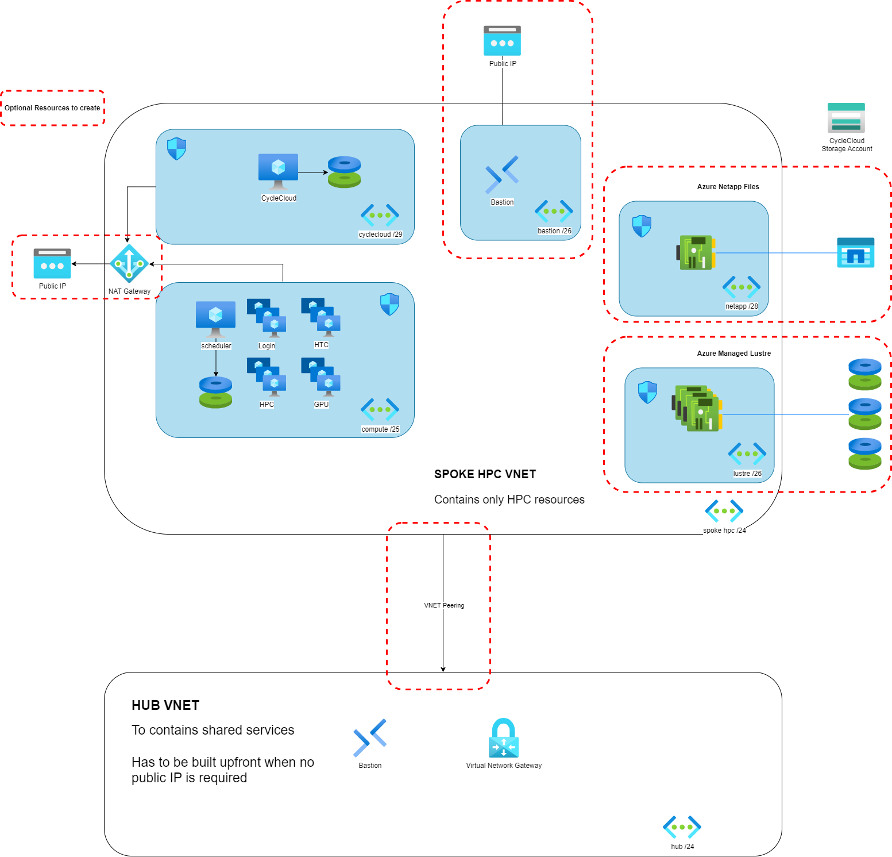

# Table of Contents
<!--ts-->
* [Azure CycleCloud Slurm Workspace](#azure-cyclecloud-slurm-workspace)
   * [How to deploy ?](#how-to-deploy-)
      * [Basics](#basics)
      * [File-system](#file-system)
         * [Users' home directory - Create New](#users-home-directory---create-new)
         * [Users' home directory - Use Existing](#users-home-directory---use-existing)
         * [Additional file-system mount - Create New](#additional-file-system-mount---create-new)
         * [Additional file-system mount - Use Existing](#additional-file-system-mount---use-existing)
      * [Networking](#networking)
         * [Create a new Virtual Network](#create-a-new-virtual-network)
         * [Use existing Virtual Network](#use-existing-virtual-network)
      * [Slurm Settings](#slurm-settings)
      * [Partition Settings](#partition-settings)
      * [Tags](#tags)
      * [Review+Create](#reviewcreate)
   * [Check your deployment](#check-your-deployment)
   * [Connect to the login node](#connect-to-the-login-node)
   * [Bring your own VNET](#bring-your-own-vnet)
   * [Contributing](#contributing)
   * [Trademarks](#trademarks)
<!--te-->
<!-- https://github.com/ekalinin/github-markdown-toc -->
<!-- ./gh-md-toc --insert --no-backup --hide-footer README.md -->

## How to deploy ?
Search for **Slurm** in the Azure Marketplace and click on the **Create** button.
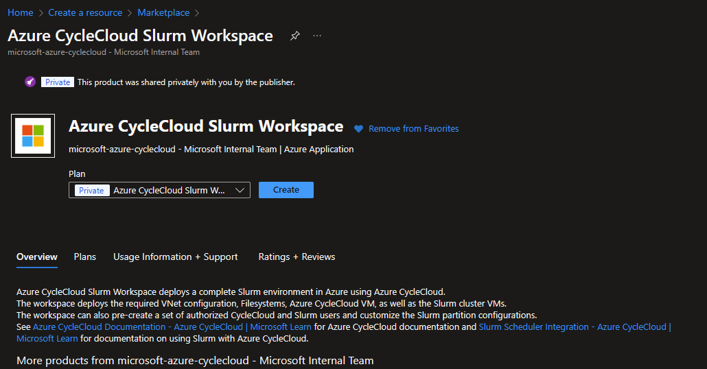

### Basics
In this tab you will have to specify where to deploy
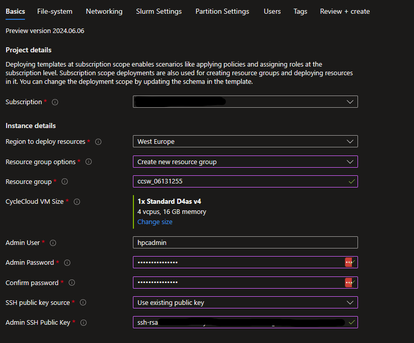
- The **Resource group options** will allow you to create a new resource group or use an existing one.
- The **CycleCloud VM Size** has been set to a best practice default value.
- The **Admin User** is the name for the VM and CycleCloud administrator account
- Choose if you provide the public SSH key of the administrator account directly or if stored in an SSH resource in Azure.

### File-system
#### Users' home directory - Create New
Specify where the users' home directory should be located. Create a new **Builtin NFS** will use the scheduler VM as an NFS server with an attached datadisk.
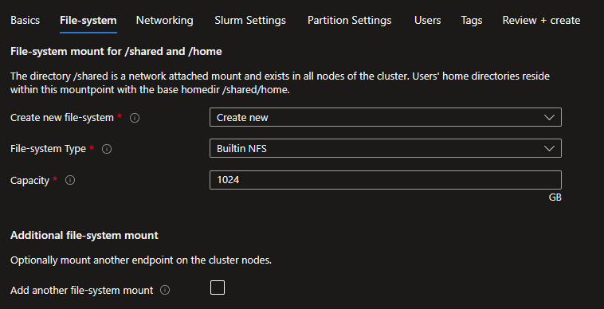

Create a new **Azure NetApp Files** will create an ANF account, pool ad volume of the specified capacity and service level.
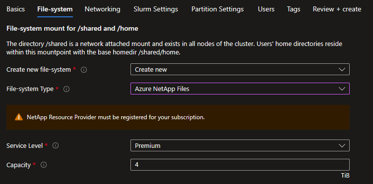

#### Users' home directory - Use Existing
If you have an existing NFS mount point than select the **Use Existing** option and specify the settings to use.
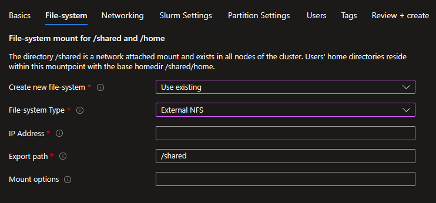

#### Additional file-system mount - Create New
If you need to mount an additional file-system for your project data, you can either create a new one or specify an existing one. You can create a new Azure NetApp File volume or an Azure Managed Lustre Filesystem.

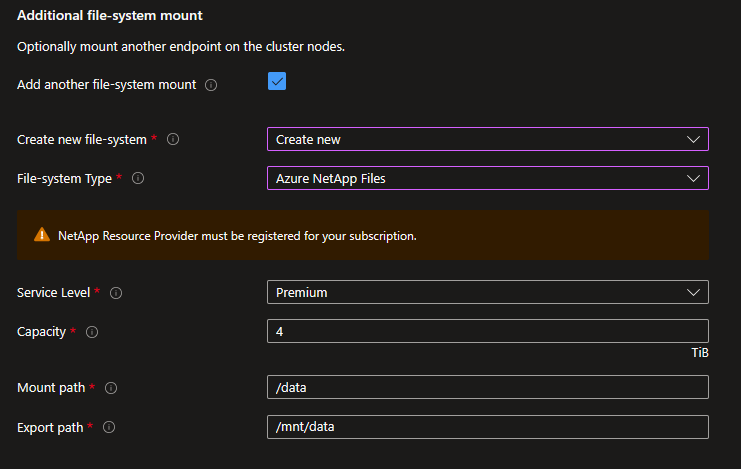

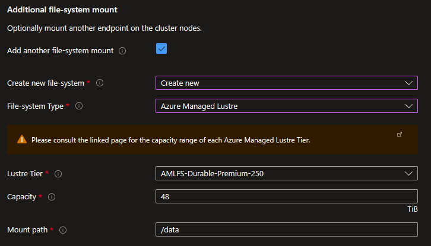

#### Additional file-system mount - Use Existing
If you have an existing NFS mount point or an Azure Managed Lustre Filesystem, you can specify the mount options.

### Networking
Specify here if you want to create a new Virtual Network and subnets or use an existing one.
#### Create a new Virtual Network
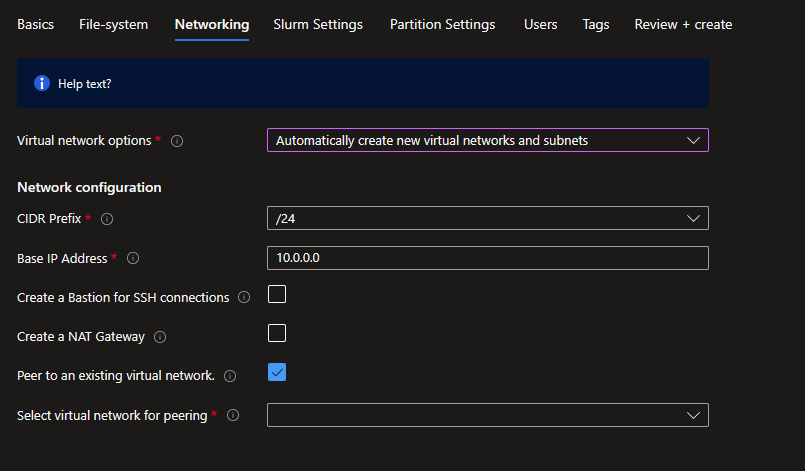
- Pickup the CIDR that will match with the number of compute nodes you are targeting and specify a base IP address,
- It is a best practice to create a Bastion if you don't have direct connectivity provided by your corporate IT,
- Creating a NAT Gateway is required to provide outbound connectivity to internet. This will become mandatory in 2025 and is already enforced thought policies by some companies,
- Peer to an existing Virtual Network if you already have a HUB you want to peer to, which will deliver services like bastion and VPN gateway. Be careful to pickup a base IP address that is compatible with your peered VNET.

#### Use existing Virtual Network
Before using an existing virtual network, check for the pre-requisites in [Bring your own VNET](#bring-your-own-vnet)
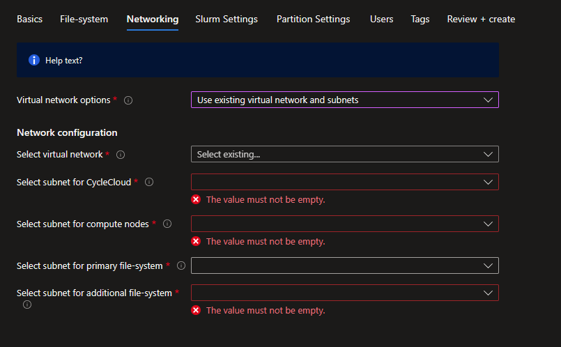

### Slurm Settings
Specify the VM size and image to use for the Scheduler and the Login nodes. Images are the HPC Images provided in the Azure Marketplace with the associated URIs:
| Image Name | URI |
|------------|-----|
| Alma Linux 8.7 | almalinux:almalinux-hpc:8_7-hpc-gen2:latest |
| Ubuntu 20.04 | microsoft-dsvm:ubuntu-hpc:2004:latest |
| Ubuntu 22.04 | microsoft-dsvm:ubuntu-hpc:2204:latest |

Set how many login nodes you want to provision at start and the maximum of them.
Finally enabling health check will execute node health checks for HPC and GPU VM types to automatically remove unhealthy nodes when they starts.

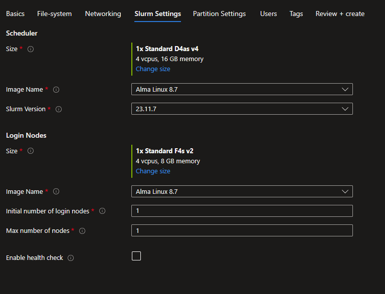

### Partition Settings
Azure CycleCloud Slurm Workspace comes with 3 defined Slurm partitions :
- HTC : for embarassingly non MPI jobs,
- HPC : for highly coupled MPI jobs mostly using VM types with Infiniband support,
- GPU : for MPI and non MPI GPU jobs

For each you can define the maximum of nodes that CycleCloud will dynamically provisioned based on job demands, as well as which image should be used. Only the HTC partition will allow the use of Spot instances as it's usually not a best practice to use Spot instances for HPC and GPU jobs. However these settings can be overriden after deployment in the CycleCloud UI.

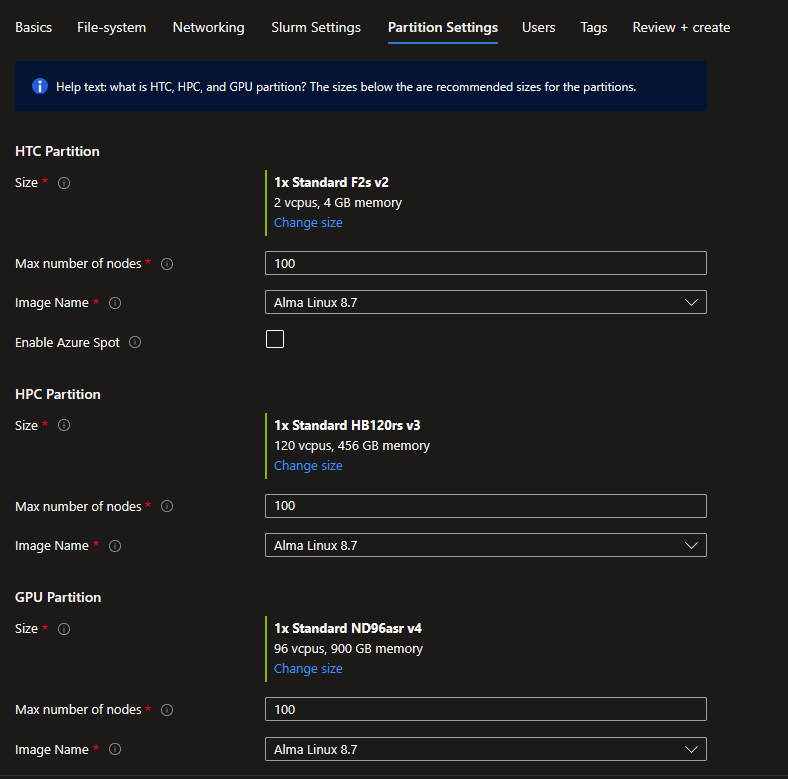

### Tags
Set the relevant tags for the resources needed.

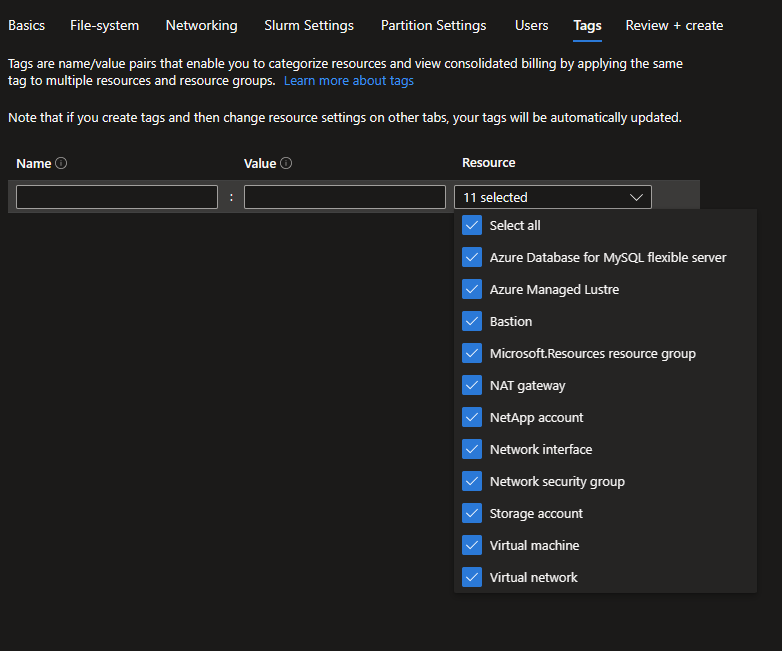

### Review+Create
Review your options, this step will also process to some validations. 
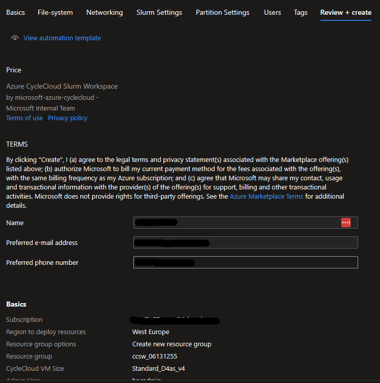

When passed, click on the **Create** button to initialize the deployment
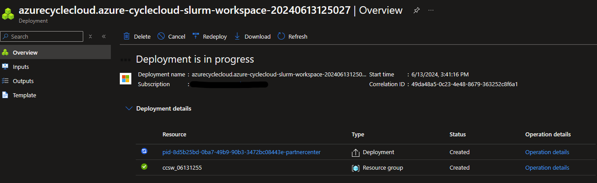

Follow the deployment status and steps.

## Check your deployment
Connect to the `ccsw-cyclecloud-vm` using Bastion with the username and SSH keys specified during the deployment.

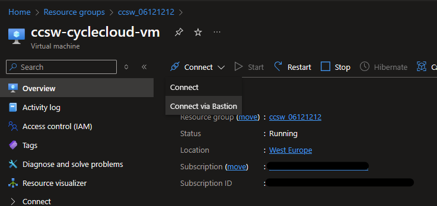
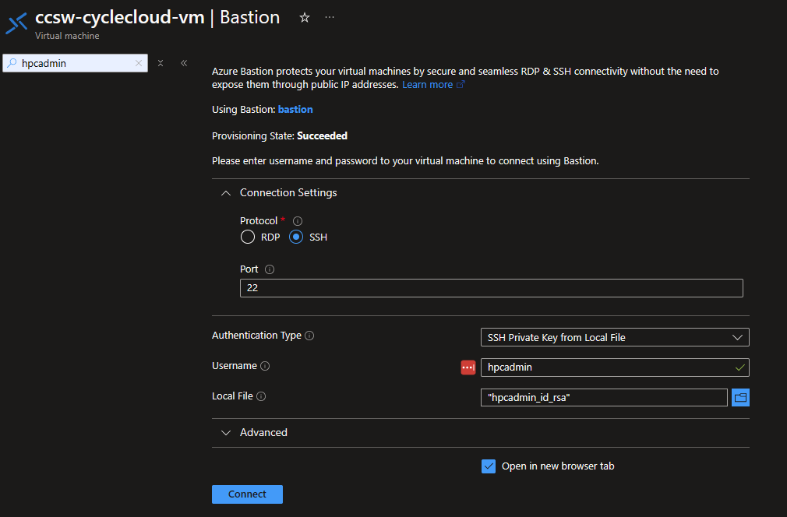

When connected, check the cloud-init logs to verify everything is correct.

```bash
$tail -f -n 25 /var/log/cloud-init-output.log
Waiting for Azure.MachineType to be populated...
Waiting for Azure.MachineType to be populated...
Waiting for Azure.MachineType to be populated...
Waiting for Azure.MachineType to be populated...
Waiting for Azure.MachineType to be populated...
Waiting for Azure.MachineType to be populated...
Waiting for Azure.MachineType to be populated...
Waiting for Azure.MachineType to be populated...
Waiting for Azure.MachineType to be populated...
Waiting for Azure.MachineType to be populated...
Waiting for Azure.MachineType to be populated...
Waiting for Azure.MachineType to be populated...
Starting cluster ccsw....
----------------------------
ccsw : allocation -> started
----------------------------
Resource group: 
Cluster nodes:
    scheduler: Off -- --  
Total nodes: 1
CC start_cluster successful
/
exiting after install
Cloud-init v. 23.4-7.el8_10.alma.1 running 'modules:final' at Wed, 12 Jun 2024 10:15:53 +0000. Up 11.84 seconds.
Cloud-init v. 23.4-7.el8_10.alma.1 finished at Wed, 12 Jun 2024 10:28:15 +0000. Datasource DataSourceAzure [seed=/dev/sr0].  Up 754.29 seconds
```

Then establish the connectivity between your client machine and the CycleCloud VM. This can be from your corporate IT, a VPN, a bastion tunnelling, an attached public IP if your company allows it. Connect to the web interface by browsing to [https://<cycleccloud_ip>](), and authenticate with the username and password provided during the deployment. Confirm that both the Scheduler and the Login node are running.

## Connect to the login node
When using the bastion, use one of the utility script __util/ssh_thru_bastion.sh__ or __util/tunnel_thru_bastion.sh__ to connect.
If not using a bastion, you have to establish the direct connectivity yourself.

## Bring your own VNET
If you bring your own VNET you have to follow these pre-requisistes :
- a /29 **cyclecloud** subnet for the CycleCloud VM, with `Microsoft.Storage` Service Endpoint assigned,
- a **compute** subnet for the nodes, with `Microsoft.Storage` Service Endpoint assigned. This is where the scheduler, login and compute nodes will be created
- when using Azure NetApp File, a dedicated **netapp** subnet with the `Microsoft.NetApp/volumes` delegation as documented [here](https://learn.microsoft.com/en-us/azure/azure-netapp-files/)
- when using Azure Managed Lustre Filesystem, a dedicated **lustre** subnet with a CIDR based on the storage capacity to provision as documented [here](https://learn.microsoft.com/en-us/azure/azure-managed-lustre/)
- if deploying a Bastion, a dedicated **BastionSubnet** as documented [here](https://learn.microsoft.com/en-us/azure/bastion/configuration-settings#subnet)
- Your NSGs, should allow communications between subnets as defined in the [bicep/network-new.bicep](./bicep/network-new.bicep) file.

## Cleaning up roles
Deleting the resource group will delete all of the resources that CCSW has created, however role assignments are not deleted. To fix this, we provide `util/delete_roles.sh` which will delete these roles for either a deleted resource group, or one where the resources were manually deleted.

```bash
util/./delete_rules.sh --location my-location --resource-group my-ccsw-rg [--delete-resource-group]
```
Note the option `--delete-resource-group` - unfortunately, we actually have to recreate the resource group and create a simple deployment that outputs the guid names that we produce for this given resource group name and location. *Passing in `--delete-resource-group` will clean up this resource group, whether we have created the resource group or not.*

## Contributing

This project welcomes contributions and suggestions.  Most contributions require you to agree to a
Contributor License Agreement (CLA) declaring that you have the right to, and actually do, grant us
the rights to use your contribution. For details, visit https://cla.opensource.microsoft.com.

When you submit a pull request, a CLA bot will automatically determine whether you need to provide
a CLA and decorate the PR appropriately (e.g., status check, comment). Simply follow the instructions
provided by the bot. You will only need to do this once across all repos using our CLA.

This project has adopted the [Microsoft Open Source Code of Conduct](https://opensource.microsoft.com/codeofconduct/).
For more information see the [Code of Conduct FAQ](https://opensource.microsoft.com/codeofconduct/faq/) or
contact [opencode@microsoft.com](mailto:opencode@microsoft.com) with any additional questions or comments.

## Trademarks

This project may contain trademarks or logos for projects, products, or services. Authorized use of Microsoft 
trademarks or logos is subject to and must follow 
[Microsoft's Trademark & Brand Guidelines](https://www.microsoft.com/en-us/legal/intellectualproperty/trademarks/usage/general).
Use of Microsoft trademarks or logos in modified versions of this project must not cause confusion or imply Microsoft sponsorship.
Any use of third-party trademarks or logos are subject to those third-party's policies.